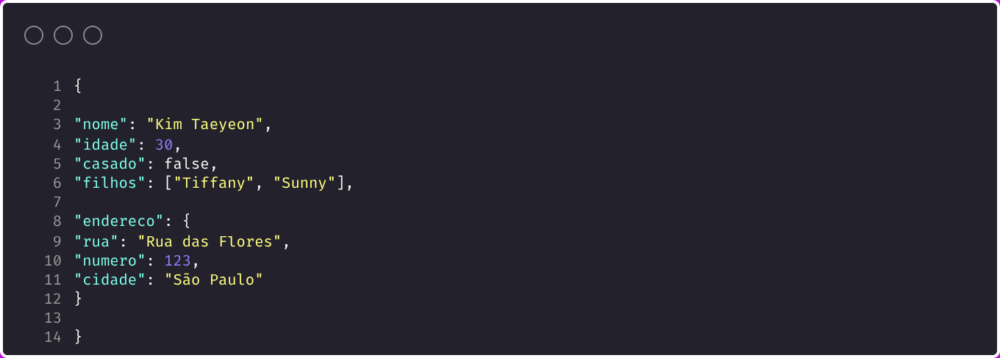

O que é JSON?

JSON (JavaScript Object Notation) é um formato leve de troca de dados, fácil para humanos lerem e escreverem, e fácil para máquinas interpretarem e gerarem.

Ele é muito usado para transmitir dados entre servidores e aplicações web, devido à sua simplicidade e compatibilidade com praticamente todas as linguagens de programação.

JSON representa dados em estruturas de objetos e arrays, usando uma sintaxe parecida com a de objetos em JavaScript, porém é uma linguagem independente.

Características principais do JSON

> Formato texto, simples e legível.
> Estrutura baseada em chave-valor (objetos).
> Suporta arrays (listas ordenadas).
> Tipos de dados suportados: strings, números, booleanos, arrays, objetos e null.

Muito utilizado em APIs e armazenamento de configurações.

E não é só utilizado no ambiente JavaScript, tá? Várias outras linguagens já adotaram a comunicação via JSON

Exemplo básico:

"nome" é uma string.
"idade" é um número.
"casado" é um valor booleano.
"filhos" é um array de strings.
"endereco" é um objeto aninhado com mais informações.

Refêrencia: https://www.json.org/json-pt.html
